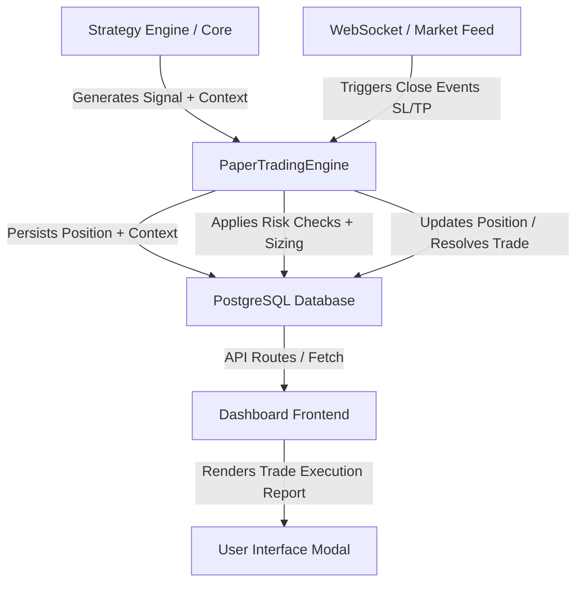

# Trade Intelligence & Execution Audit Platform Documentation

This document describes the design, database schema, data flow pipeline, and verification metrics of the upgraded professional-grade Trade Intelligence & Execution Audit platform in Synapse.

---

## 1. System Architecture Overview

The Trade Intelligence & Execution Audit system is built to capture, persist, and display the full technical and execution context of every trade generated by autonomous strategies or manual actions. 

This ensures that the trading engine operates with high transparency and complete auditability, persisting exactly why a trade was opened, what technical indicators looked like at entry, what the prevailing market regime was, how the risk was managed (R-Multiple), and how the position was ultimately closed.

### Data Flow Diagram



---

## 2. Database Schema Details

The database schema has been updated in [schema.prisma](file:///home/tejas-ambaliya/Desktop/Synapse1/prisma/schema.prisma) to add comprehensive audit columns to both active `Position` and completed `Trade` models.

### Position Model Schema
Stores floating active positions with their initial strategy trigger context:
- `strategyId` (String?): Identifier of the active strategy (e.g. `ema-cross-adx`).
- `strategyName` (String?): Human-readable name of the strategy (e.g. `EMA Cross ADX`).
- `strategyCategory` (String?): Categorization of the strategy (e.g. `Trend Following`).
- `entryReason` (String?): Text description explaining why the signal was triggered.
- `confidenceAtEntry` (Float?): The confidence level (0.0 to 1.0) of the signal at the execution moment.
- `marketRegime` (String?): Identified market condition (e.g. `BULLISH_TREND`, `RANGING`).
- `indicatorSnapshot` (Json?): JSON object containing snapshot values of key technical indicators at entry.

### Trade Model Schema
Stores completed historical trades to preserve context forever:
- `strategyId` (String?)
- `strategyCategory` (String?)
- `entryReason` (String?)
- `exitReason` (String?): Automated explanation detailing how the trade was closed (SL hit, TP hit, manual, timeout, etc.).
- `confidenceAtEntry` (Float?)
- `marketRegime` (String?)
- `indicatorSnapshot` (Json?)

---

## 3. End-to-End Execution Pipeline

The execution context passes through four distinct phases:

### Phase A: Signal Generation
The strategy engine evaluates market tickers. If a buy/sell condition is met, `SignalGenerator` maps the strategy ID to its respective category (defined in [signal-generator.ts](file:///home/tejas-ambaliya/Desktop/Synapse1/src/strategy-engine/core/signal-generator.ts)) and constructs a `StrategySignal` carrying the reasoning and current technical indicators context.

### Phase B: Position Entry
The daemon or Next.js route passes the signal object into [PaperTradingEngine.openPosition()](file:///home/tejas-ambaliya/Desktop/Synapse1/src/execution-engine/paper/index.ts). The engine extracts:
- Strategy details
- Join-formatted entry reasons
- Multi-indicator mapping snapshots
- Active regime category

These details are saved into the database `Position` table.

### Phase C: Close & Audit Resolution
Upon a manual close, stop-loss trigger, or take-profit trigger, [PaperTradingEngine.closePosition()](file:///home/tejas-ambaliya/Desktop/Synapse1/src/execution-engine/paper/index.ts) is executed. It calculates the final PnL, ROI, and formats a descriptive `exitReason` detailing price difference percentages and target triggers. This final audit block is written into the `Trade` history table, and the active `Position` is set to `CLOSED`.

### Phase D: Trade Execution Report UI
The Trade History dashboard page ([app/trade-history/page.tsx](file:///home/tejas-ambaliya/Desktop/Synapse1/app/trade-history/page.tsx)) reads the intelligence columns and renders a comprehensive 4-section report:
1. **Trade Overview**: Symbols, side, strategy tags, net PnL, and ROI.
2. **Entry Analysis**: Narrative entry reasoning box, confidence score, regime tag, and formatted indicator snapshot grid.
3. **Exit Analysis**: Detailed exit reason explanation, timestamp, and duration calculator.
4. **Risk Metrics**: Quantities, entry/exit prices, Stop Loss/Take Profit limits, and the calculated **R-Multiple** (risk-to-reward multiple).

---

## 4. Key Modified Files & Symbols

- [prisma/schema.prisma](file:///home/tejas-ambaliya/Desktop/Synapse1/prisma/schema.prisma): Added columns to `Position` and `Trade`.
- [src/strategy-engine/types.ts](file:///home/tejas-ambaliya/Desktop/Synapse1/src/strategy-engine/types.ts): Modified `StrategySignal` interface.
- [src/strategy-engine/core/signal-generator.ts](file:///home/tejas-ambaliya/Desktop/Synapse1/src/strategy-engine/core/signal-generator.ts): Enhanced to map strategy categories.
- [src/execution-engine/types.ts](file:///home/tejas-ambaliya/Desktop/Synapse1/src/execution-engine/types.ts): Added fields to `VirtualPosition`.
- [src/execution-engine/paper/index.ts](file:///home/tejas-ambaliya/Desktop/Synapse1/src/execution-engine/paper/index.ts): Handled context propagation, DB persistence, and formatting.
- [src/server/daemon.ts](file:///home/tejas-ambaliya/Desktop/Synapse1/src/server/daemon.ts): Adapted direct database handlers.
- [app/api/positions/route.ts](file:///home/tejas-ambaliya/Desktop/Synapse1/app/api/positions/route.ts): Updated API routes to carry strategy context.
- [app/trade-history/page.tsx](file:///home/tejas-ambaliya/Desktop/Synapse1/app/trade-history/page.tsx): Redesigned the details modal to show the 4-section Trade Execution Report.

---

## 5. Verification & Test Logs

An integration verification script was created and run locally at [scratch/test-trade-audit.ts](file:///home/tejas-ambaliya/Desktop/Synapse1/scratch/test-trade-audit.ts) to validate the end-to-end pipeline.

### Verification Execution Results

```bash
$ npx tsx scratch/test-trade-audit.ts

=== Running Trade Intelligence & Execution Audit Pipeline Test ===
[TEST] Cleaning up previous test data in database...
[TEST] Creating test user, settings, and wallet...
[TEST] Wallet balance initialized: $10000
[TEST] Registering direct Prisma DB handlers to PaperTradingEngine...
[TEST] Initializing client stores...
[PaperTrading] Loaded 0 active positions from database.

--- STEP 1: Opening Position with Strategy Context ---
[PAPER_TRADING] Attempting to open position: LONG BTCUSDT @ $50000
[TRADE_ALLOWED] No active position found for BTCUSDT
[POSITION_SIZING] Wallet balance: $10000.00 | Risk per trade: 5% | Leverage: 1x | Calculated order size: $500.00
[RISK_ENGINE] Validating order: LONG BTCUSDT @ $50000 | Qty: 0.01 | Leverage: 1x | Available: $10000.00
[RISK_ENGINE] Order approved by Risk Engine.
[DB_WRITE] Dispatching position open transaction to database for BTCUSDT
[TRADE_CREATED] Trade successfully saved in DB. Position ID: d427fb63-b870-4b65-92b1-8e7b2f78ad03
[POSITION_OPENED] ✅ Opened position: LONG BTCUSDT at $50000 | Qty: 0.010000 | SL: 49000 | TP: 52000
[TEST] SUCCESS: Opened Position ID: d427fb63-b870-4b65-92b1-8e7b2f78ad03

[TEST] Verifying Position database fields...
Database Position Data:
- strategyId: ema-cross-adx (Expected: "ema-cross-adx")
- strategyName: EMA Cross ADX (Expected: "EMA Cross ADX")
- strategyCategory: Trend Following (Expected: "Trend Following")
- entryReason: EMA 12 crossed EMA 26 upwards. ADX shows strong trend strength (> 25) (Expected: containing reasoning)
- confidenceAtEntry: 0.85 (Expected: 0.85)
- marketRegime: BULLISH_TREND (Expected: "BULLISH_TREND")
- indicatorSnapshot: {"adx":28.1,"rsi":62.4,"ema12":50120,"ema26":50050}
[TEST] ✅ Position fields verified successfully.

--- STEP 2: Closing Position (Simulating Take Profit Hit) ---
[PAPER_TRADING] Closing position d427fb63-b870-4b65-92b1-8e7b2f78ad03 for BTCUSDT at exit price $52100 (Reason: TAKE_PROFIT)
[DB_WRITE] Dispatching position close transaction to database for ID: d427fb63-b870-4b65-92b1-8e7b2f78ad03
[POSITION_CLOSED] ✅ Closed position: LONG BTCUSDT at $52100 (TAKE_PROFIT). PnL: $21.00
[COOLDOWN_APPLIED] Added 5m cooldown for BTCUSDT.
[TEST] Position updated to CLOSED in DB.

[TEST] Verifying Trade database fields...
Database Trade Data:
- strategyId: ema-cross-adx (Expected: "ema-cross-adx")
- strategyName: EMA Cross ADX (Expected: "EMA Cross ADX")
- strategyCategory: Trend Following (Expected: "Trend Following")
- entryReason: EMA 12 crossed EMA 26 upwards. ADX shows strong trend strength (> 25) (Expected: containing entry reasoning)
- exitReason: Take Profit reached at $52100.00. (Expected: containing "Take Profit reached")
- confidenceAtEntry: 0.85 (Expected: 0.85)
- confidence: 0.85 (Expected: 0.85)
- marketRegime: BULLISH_TREND (Expected: "BULLISH_TREND")
- indicatorSnapshot: {"adx":28.1,"rsi":62.4,"ema12":50120,"ema26":50050}
- status: TP HIT (Expected: "TP HIT")
- pnl: $21 (Expected: positive value)
- roi: 4.2% (Expected: positive value)
[TEST] ✅ Trade fields verified successfully.

[TEST] Cleaning up test database records...
=== ALL TRADE AUDIT PIPELINE TESTS PASSED SUCCESSFULLY! ===
```
