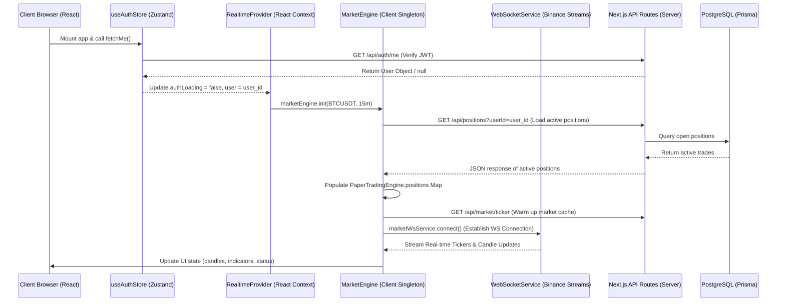
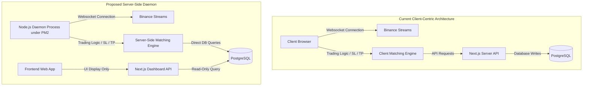

# Synapse Trading Runtime Architecture Audit

This document presents a comprehensive audit of the execution lifecycle, dependency trees, and runtime architecture of the Synapse trading engine. The goal is to determine whether the system is capable of running 24/7 in a headless server environment.

---

## 1. Core Architecture Discovery & Codebase Search Results

The codebase was scanned for key class instantiations, initialization functions, and hooks:

| Search Term | Occurrence / Instantiation Location | Context |
| :--- | :--- | :--- |
| `new MarketEngine` | [market-engine.ts](file:///home/tejas-ambaliya/Desktop/Synapse1/src/market-engine/market-engine.ts#L478) | Instantiates and exports singleton `marketEngine` |
| `MarketEngine.getInstance` | *None* | Singleton pattern is handled via ES6 export, not dynamic method |
| `connectWebSocket()` | *None* (uses `marketWsService.connect()`) | Instantiated in [websocket/index.ts](file:///home/tejas-ambaliya/Desktop/Synapse1/src/market-engine/websocket/index.ts#L261) |
| `PaperTradingEngine` | [index.ts](file:///home/tejas-ambaliya/Desktop/Synapse1/src/execution-engine/paper/index.ts#L6) | Static utility class managing in-memory positions & API writes |
| `StrategyEngine` | [engine.ts](file:///home/tejas-ambaliya/Desktop/Synapse1/src/strategy-engine/core/engine.ts#L235) | Instantiated and exported as singleton `strategyEngine` |
| `autoTrading` | Settings stores, Prisma schema | Used to check if trades should be executed |

---

## 2. Trading Runtime Startup Sequence

When a user navigates to the Synapse Web App, the startup sequence executes as follows:



### Key Initializing Files:
1. **React Entry point**: [realtime-provider.tsx](file:///home/tejas-ambaliya/Desktop/Synapse1/providers/realtime-provider.tsx)
   - Triggers `marketEngine.init()` on mount (once authentication loads).
   - Starts global WebSocket connections via `marketWsService.connect()`.
2. **WebSocket Ingestion**: [websocket/index.ts](file:///home/tejas-ambaliya/Desktop/Synapse1/src/market-engine/websocket/index.ts)
   - Connects to Binance public streams.
   - Registers callback handlers for ticker and kline events.
3. **Execution Distributor**: [market-engine.ts](file:///home/tejas-ambaliya/Desktop/Synapse1/src/market-engine/market-engine.ts)
   - Receives ticks and routes them:
     - Ticker price ticks $\rightarrow$ `PaperTradingEngine.updatePrices()` (checks SL/TP bounds).
     - Kline candle closures $\rightarrow$ `recalculate()` (strategy signals & indicator generation).
4. **Strategy Processor**: [engine.ts](file:///home/tejas-ambaliya/Desktop/Synapse1/src/strategy-engine/core/engine.ts)
   - Runs `processTick()`, calculates indicators, evaluates strategies in the registry, and issues trading signals.
5. **Execution engine (paper)**: [index.ts](file:///home/tejas-ambaliya/Desktop/Synapse1/src/execution-engine/paper/index.ts)
   - Opens/closes virtual positions, checks limits, and executes HTTP requests to `/api/positions` to write records to Postgres.

---

## 3. Runtime Dependency Analysis & Answers

- **What file creates MarketEngine?**
  [market-engine.ts](file:///home/tejas-ambaliya/Desktop/Synapse1/src/market-engine/market-engine.ts#L478)
- **What file starts WebSocket connections?**
  [realtime-provider.tsx](file:///home/tejas-ambaliya/Desktop/Synapse1/providers/realtime-provider.tsx#L53)
- **What file starts strategy evaluation?**
  [market-engine.ts](file:///home/tejas-ambaliya/Desktop/Synapse1/src/market-engine/market-engine.ts#L297) (delegates to `strategyEngine.processTick()`)
- **What file starts autonomous trading?**
  [market-engine.ts](file:///home/tejas-ambaliya/Desktop/Synapse1/src/market-engine/market-engine.ts#L371-L420) (calls `PaperTradingEngine.openPosition()`)

### Entry Point Determination:
**A) React page/component**
The engine initialization starts entirely on the frontend client side via the `RealtimeProvider` component wrapping the root layout of the React Next.js application.

---

## 4. Operational Auditing Questions

| Question | Answer | Technical Explanation |
| :--- | :--- | :--- |
| **Is browser required?** | **YES** | All engine calculations (indicator loops, strategy executions) and WebSocket connections run strictly in client-side Javascript. |
| **Is dashboard required?** | **YES** | A frontend page must be open in a browser tab to maintain the active WebSocket feeds and execute indicator loops. |
| **Does system continue after logout?** | **PARTIALLY** | The WebSocket and indicators will continue running for guest (`default-user-id`) if the browser remains open, but the logged-in user's trades will no longer be monitored or closed. |
| **Does system continue after browser close?** | **NO** | Closing the browser tab terminates the execution loop instantly. No further signals will be generated and TP/SL levels will be ignored. |
| **Does system continue after server restart?** | **NO** | If the Next.js server restarts, existing active browser sessions will reconnect to APIs, but if no browser is open, no trading occurs. |
| **Is the system truly 24/7?** | **NO** | The engine requires a browser session to run. It does not run headlessly on the server side. |

---

## 5. Architectural Verdict

> [!CAUTION]
> **VERDICT: NOT SAFE FOR 24/7**
> 
> The core execution engine is bound to the React client context. Standard server deployments will not run the trade execution loop unless a client keeps a browser tab permanently active. This is extremely unsafe for production trading, as connection drops, computer sleep modes, or tab crashes will leave open positions unmanaged (resulting in catastrophic liquidation or loss).

---

## 6. PM2 Continuous Server-Side Architecture Blueprint

To make Synapse truly 24/7, we must move the execution loops from the client-side React layers to a server-side daemon process. Below is the blueprint to implement this.

### Architecture Comparison



### Steps to Implement the Headless Server Daemon

#### 1. Decouple Web Dependencies from Engine Core
The engines currently import Zustand stores (e.g. `useSettingsStore`, `useWalletStore`, `useAuthStore`) and execute browser-only `fetch` calls. We must wrap these calls in interface layers that compile in Node.js:
- **Zustand Stores $\rightarrow$ Direct Database Queries**: Create a server-side configurations service that loads settings (`autoTrading`, `riskPerTradePct`, etc.) directly from PostgreSQL via Prisma.
- **`fetch()` API calls $\rightarrow$ Server Service Calls**: Instead of making HTTP requests to `/api/positions`, call Prisma database transactions directly.

#### 2. Create the Background Daemon File (`src/server/daemon.ts`)
Create a server script that initializes the engines and processes WebSocket ticks headlessly in a Node.js context. It will run a continuous event loop:

```typescript
// src/server/daemon.ts
import { PrismaClient } from "@prisma/client";
import { WebSocket } from "ws"; // Node-compatible ws package
import { strategyEngine } from "../strategy-engine/core/engine";
import { PaperTradingEngine } from "../execution-engine/paper";
import { initializeStrategies } from "../strategy-engine/strategies";

const prisma = new PrismaClient();

async function runDaemon() {
  console.log("[Daemon] Starting Synapse 24/7 Server Engine...");
  
  // Register strategies on the server
  initializeStrategies();

  // Load all users settings and active positions
  const activePositions = await prisma.position.findMany({ where: { status: "OPEN" } });
  console.log(`[Daemon] Loaded ${activePositions.length} active positions across all users.`);

  // Connect to Binance Websocket Streams
  const ws = new WebSocket("wss://stream.binance.com:9443/ws");

  ws.on("open", () => {
    console.log("[Daemon] Websocket stream established with Binance.");
    // Subscribe to core ticker streams for all active coins
    ws.send(JSON.stringify({
      method: "SUBSCRIBE",
      params: ["btcusdt@ticker", "ethusdt@ticker", "solusdt@ticker"],
      id: 1
    }));
  });

  ws.on("message", async (data) => {
    const message = JSON.parse(data.toString());
    
    // Process Ticker updates
    if (message.e === "24hrTicker") {
      const symbol = message.s;
      const currentPrice = parseFloat(message.c);

      // Evaluate active user positions against new price tick (SL/TP executions)
      await PaperTradingEngine.updatePricesServer(symbol, currentPrice, prisma);
    }
  });
}

runDaemon().catch(err => {
  console.error("[Daemon] Fatal Crash:", err);
  process.exit(1);
});
```

#### 3. Update PaperTradingEngine to run Server-Side
Modify `PaperTradingEngine` so it can accept a `PrismaClient` reference to run database transactions directly, avoiding HTTP API calls when executing in a headless context.

```typescript
// Update PaperTradingEngine to handle database actions directly
public static async updatePricesServer(symbol: string, currentPrice: number, prisma: PrismaClient) {
  const sym = symbol.toUpperCase();
  const openPositions = await prisma.position.findMany({
    where: { symbol: sym, status: "OPEN" }
  });

  for (const pos of openPositions) {
    let shouldClose = false;
    let exitReason = "";

    if (pos.direction === "LONG") {
      if (pos.stopLoss && currentPrice <= pos.stopLoss) {
        shouldClose = true;
        exitReason = "STOP_LOSS";
      } else if (pos.takeProfit && currentPrice >= pos.takeProfit) {
        shouldClose = true;
        exitReason = "TAKE_PROFIT";
      }
    } else {
      if (pos.stopLoss && currentPrice >= pos.stopLoss) {
        shouldClose = true;
        exitReason = "STOP_LOSS";
      } else if (pos.takeProfit && currentPrice <= pos.takeProfit) {
        shouldClose = true;
        exitReason = "TAKE_PROFIT";
      }
    }

    if (shouldClose) {
      await this.closePositionServer(pos.id, currentPrice, exitReason, prisma);
    }
  }
}
```

#### 4. Configure PM2 for Deployment
Deploy this daemon as a background service on the EC2 instance using a PM2 ecosystem file:

Create `ecosystem.config.js` in the project root:
```javascript
module.exports = {
  apps: [
    {
      name: "synapse-next-app",
      script: "npm",
      args: "run start",
      env: {
        NODE_ENV: "production",
      }
    },
    {
      name: "synapse-trading-daemon",
      script: "npx tsx src/server/daemon.ts",
      instances: 1,
      autorestart: true,
      watch: false,
      max_memory_restart: "1G",
      env: {
        NODE_ENV: "production",
      }
    }
  ]
};
```

Run PM2 to start both the Web dashboard and the background trading loop:
```bash
pm2 start ecosystem.config.js
pm2 save
pm2 startup
```

This configuration ensures:
1. **True 24/7 Execution**: The trading loop runs in a headless Node process.
2. **Crash Resilience**: PM2 restarts the process instantly if it crashes.
3. **No Browser Required**: The dashboard client only views data from the database, without participating in the actual execution pipeline.
